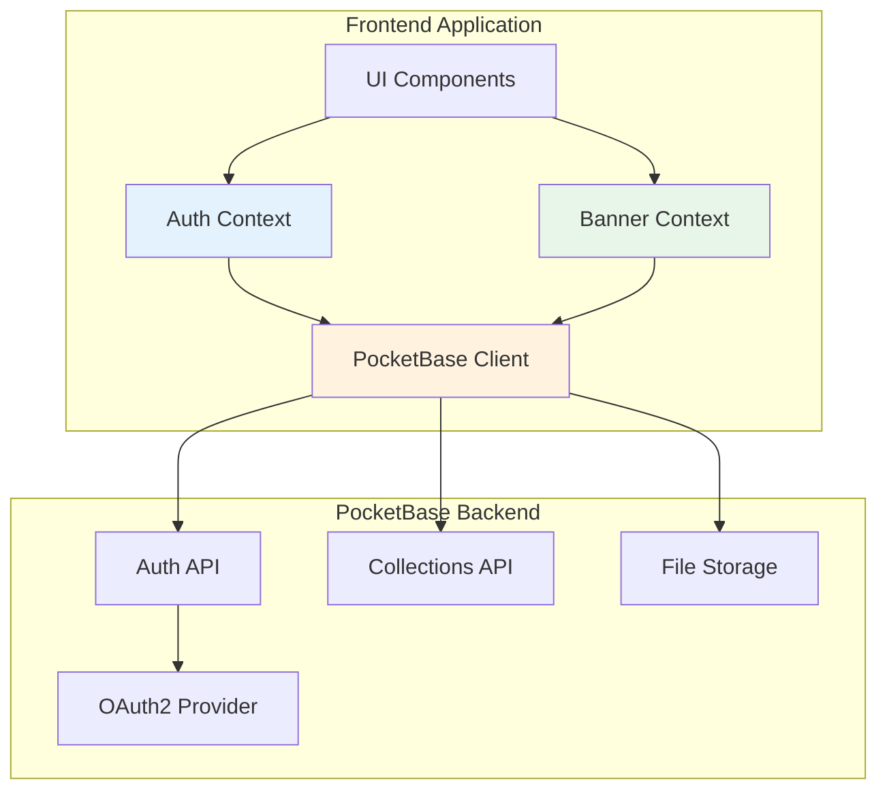
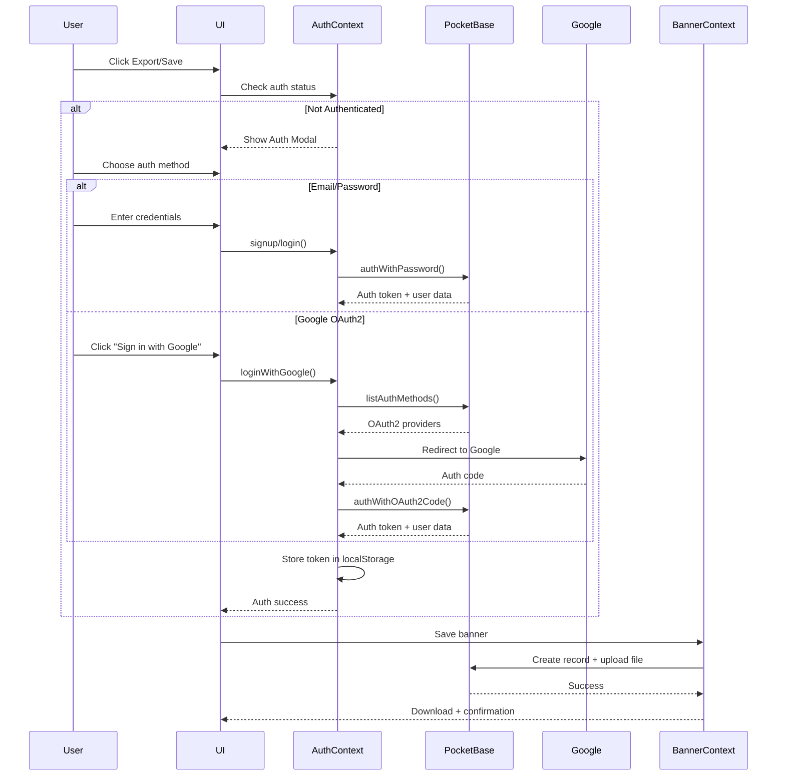
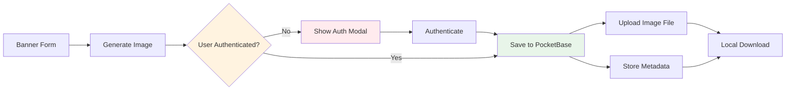

# Design Document: PocketBase Authentication and Banner Saving

## Overview

This design implements user authentication and banner persistence for LoomGraph using PocketBase as the backend service. The implementation adds authentication via email/password and Google OAuth2, enables users to save generated banners to cloud storage, and maintains backward compatibility with existing banner generation features.

The design follows a layered architecture approach:
- **Authentication Layer**: Manages user identity, sessions, and OAuth2 flows
- **Storage Layer**: Handles banner persistence and file uploads
- **UI Layer**: Provides authentication modals and user account interface
- **Integration Layer**: Connects authentication with existing export functionality

Key design principles:
- Minimal disruption to existing codebase
- Secure token management following PocketBase best practices
- Clean separation between authentication and banner generation logic
- Graceful error handling with user-friendly feedback
- Consistent with Bento design system aesthetic

## Architecture

### System Components



### Authentication Flow



### Data Flow



## Components and Interfaces

### 1. PocketBase Client Service

**Purpose**: Singleton service managing PocketBase SDK instance and configuration

**Location**: `src/services/pocketbase.ts`

**Interface**:
```typescript
class PocketBaseService {
  private pb: PocketBase;
  private static instance: PocketBaseService;
  
  private constructor() {
    this.pb = new PocketBase('https://training-pocketbase-01.g5amlv.easypanel.host');
    
    // Enable auto-cancellation for pending requests
    this.pb.autoCancellation(false);
    
    // Load stored auth on initialization
    this.pb.authStore.loadFromCookie(document.cookie);
  }
  
  static getInstance(): PocketBaseService;
  getClient(): PocketBase;
  isAuthenticated(): boolean;
  getCurrentUser(): Record | null;
}

export const pb = PocketBaseService.getInstance().getClient();
```

**Key Decisions**:
- Singleton pattern ensures single PocketBase instance across app
- Auto-cancellation disabled to prevent request conflicts during navigation
- Auth state loaded from cookie/localStorage on initialization
- Exposes raw PocketBase client for flexibility

### 2. Authentication Context

**Purpose**: React Context providing authentication state and methods throughout the app

**Location**: `src/context/AuthContext.tsx`

**Interface**:
```typescript
interface AuthContextValue {
  user: Record | null;
  isAuthenticated: boolean;
  isLoading: boolean;
  error: string | null;
  
  // Email/Password methods
  signup(email: string, password: string, passwordConfirm: string, name?: string): Promise<void>;
  login(email: string, password: string): Promise<void>;
  
  // OAuth2 methods
  loginWithGoogle(): Promise<void>;
  handleOAuthCallback(): Promise<void>;
  
  // Session management
  logout(): Promise<void>;
  refreshAuth(): Promise<void>;
  clearError(): void;
}

interface AuthProviderProps {
  children: React.ReactNode;
}

export function AuthProvider({ children }: AuthProviderProps): JSX.Element;
export function useAuth(): AuthContextValue;
```

**Implementation Details**:

```typescript
export function AuthProvider({ children }: AuthProviderProps) {
  const [user, setUser] = useState<Record | null>(null);
  const [isLoading, setIsLoading] = useState(true);
  const [error, setError] = useState<string | null>(null);
  
  // Initialize auth state on mount
  useEffect(() => {
    const initAuth = async () => {
      try {
        if (pb.authStore.isValid) {
          // Refresh to ensure token is still valid
          await pb.collection('users').authRefresh();
          setUser(pb.authStore.record);
        }
      } catch (err) {
        // Token expired or invalid
        pb.authStore.clear();
      } finally {
        setIsLoading(false);
      }
    };
    
    initAuth();
  }, []);
  
  // Subscribe to auth store changes
  useEffect(() => {
    return pb.authStore.onChange((token, record) => {
      setUser(record);
    });
  }, []);
  
  const signup = async (email: string, password: string, passwordConfirm: string, name?: string) => {
    setIsLoading(true);
    setError(null);
    
    try {
      await pb.collection('users').create({
        email,
        password,
        passwordConfirm,
        name,
        emailVisibility: true
      });
      
      // Auto-login after signup
      await login(email, password);
    } catch (err: any) {
      setError(err.message || 'Signup failed');
      throw err;
    } finally {
      setIsLoading(false);
    }
  };
  
  const login = async (email: string, password: string) => {
    setIsLoading(true);
    setError(null);
    
    try {
      const authData = await pb.collection('users').authWithPassword(email, password);
      setUser(authData.record);
    } catch (err: any) {
      setError(err.message || 'Login failed');
      throw err;
    } finally {
      setIsLoading(false);
    }
  };
  
  const loginWithGoogle = async () => {
    setIsLoading(true);
    setError(null);
    
    try {
      // Get OAuth2 providers
      const authMethods = await pb.collection('users').listAuthMethods();
      const googleProvider = authMethods.oauth2?.providers.find(p => p.name === 'google');
      
      if (!googleProvider) {
        throw new Error('Google authentication not configured');
      }
      
      // Store provider data for callback
      const redirectURL = `${window.location.origin}/oauth-callback`;
      localStorage.setItem('oauth_provider', JSON.stringify(googleProvider));
      localStorage.setItem('oauth_redirect', redirectURL);
      
      // Redirect to Google
      window.location.href = googleProvider.authURL + redirectURL;
    } catch (err: any) {
      setError(err.message || 'Google login failed');
      setIsLoading(false);
      throw err;
    }
  };
  
  const handleOAuthCallback = async () => {
    setIsLoading(true);
    setError(null);
    
    try {
      const params = new URL(window.location.href).searchParams;
      const code = params.get('code');
      const state = params.get('state');
      
      const providerData = JSON.parse(localStorage.getItem('oauth_provider') || '{}');
      const redirectURL = localStorage.getItem('oauth_redirect') || '';
      
      if (providerData.state !== state) {
        throw new Error('State mismatch - possible CSRF attack');
      }
      
      const authData = await pb.collection('users').authWithOAuth2Code(
        providerData.name,
        code!,
        providerData.codeVerifier,
        redirectURL,
        { emailVisibility: true }
      );
      
      setUser(authData.record);
      
      // Clean up
      localStorage.removeItem('oauth_provider');
      localStorage.removeItem('oauth_redirect');
      
      // Redirect back to main app
      window.location.href = '/';
    } catch (err: any) {
      setError(err.message || 'OAuth callback failed');
      throw err;
    } finally {
      setIsLoading(false);
    }
  };
  
  const logout = async () => {
    pb.authStore.clear();
    setUser(null);
  };
  
  const refreshAuth = async () => {
    try {
      await pb.collection('users').authRefresh();
      setUser(pb.authStore.record);
    } catch (err) {
      pb.authStore.clear();
      setUser(null);
      throw err;
    }
  };
  
  const clearError = () => setError(null);
  
  const value: AuthContextValue = {
    user,
    isAuthenticated: !!user,
    isLoading,
    error,
    signup,
    login,
    loginWithGoogle,
    handleOAuthCallback,
    logout,
    refreshAuth,
    clearError
  };
  
  return <AuthContext.Provider value={value}>{children}</AuthContext.Provider>;
}
```

**Key Decisions**:
- Context pattern provides global auth state without prop drilling
- Auto-refresh on mount ensures token validity
- Subscribe to authStore changes for reactive updates
- Separate error state for granular error handling
- OAuth2 flow uses localStorage for state management (standard practice)

### 3. Banner Storage Service

**Purpose**: Handles saving banners to PocketBase with file uploads

**Location**: `src/services/bannerStorage.ts`

**Interface**:
```typescript
interface SaveBannerParams {
  title: string;
  dimension: 'landscape' | 'square' | 'portrait';
  imageBlob: Blob;
  metadata: {
    speakerName?: string;
    speakerTitle?: string;
    date?: string;
    time?: string;
    timezone?: string;
    accentColor?: string;
    hasHeadshot?: boolean;
    hasLogo?: boolean;
  };
}

interface SavedBanner {
  id: string;
  user: string;
  title: string;
  image: string;
  dimension: string;
  metadata: Record<string, any>;
  created: string;
  updated: string;
}

export async function saveBanner(params: SaveBannerParams): Promise<SavedBanner>;
export async function getUserBanners(userId: string): Promise<SavedBanner[]>;
export function getBannerImageUrl(banner: SavedBanner): string;
```

**Implementation**:
```typescript
export async function saveBanner(params: SaveBannerParams): Promise<SavedBanner> {
  const { title, dimension, imageBlob, metadata } = params;
  
  // Create FormData for multipart upload
  const formData = new FormData();
  formData.append('title', title);
  formData.append('dimension', dimension);
  formData.append('metadata', JSON.stringify(metadata));
  formData.append('image', imageBlob, `banner-${Date.now()}.png`);
  
  // User relation is automatically set by PocketBase using auth token
  const record = await pb.collection('banners').create<SavedBanner>(formData);
  
  return record;
}

export async function getUserBanners(userId: string): Promise<SavedBanner[]> {
  const records = await pb.collection('banners').getFullList<SavedBanner>({
    filter: `user = "${userId}"`,
    sort: '-created'
  });
  
  return records;
}

export function getBannerImageUrl(banner: SavedBanner): string {
  return pb.files.getURL(banner, banner.image);
}
```

**Key Decisions**:
- FormData used for multipart file uploads (PocketBase requirement)
- User relation automatically set by PocketBase from auth token
- Metadata stored as JSON for flexibility
- Helper function for generating file URLs
- Timestamp in filename prevents collisions

### 4. Auth Modal Component

**Purpose**: Modal dialog for user signup/login

**Location**: `src/components/auth/AuthModal.tsx`

**Interface**:
```typescript
interface AuthModalProps {
  isOpen: boolean;
  onClose: () => void;
  onSuccess?: () => void;
  mode?: 'login' | 'signup';
}

export function AuthModal({ isOpen, onClose, onSuccess, mode = 'login' }: AuthModalProps): JSX.Element;
```

**UI Structure**:
- Modal overlay with backdrop
- Toggle between login/signup modes
- Email/password form with validation
- "Sign in with Google" button
- Error display area
- Loading states during auth operations
- Close button (dismissible)

**Styling**: Follows Bento design system with soft depth aesthetic

### 5. User Menu Component

**Purpose**: Displays user account info and logout option

**Location**: `src/components/auth/UserMenu.tsx`

**Interface**:
```typescript
interface UserMenuProps {
  className?: string;
}

export function UserMenu({ className }: UserMenuProps): JSX.Element | null;
```

**UI Structure**:
- Dropdown menu triggered by user avatar/icon
- Display user email or name
- Logout button
- Only renders when user is authenticated
- Keyboard accessible

### 6. OAuth Callback Page

**Purpose**: Handles OAuth2 redirect and completes authentication

**Location**: `src/pages/OAuthCallback.tsx`

**Implementation**:
```typescript
export function OAuthCallback(): JSX.Element {
  const { handleOAuthCallback, error } = useAuth();
  const [isProcessing, setIsProcessing] = useState(true);
  
  useEffect(() => {
    const processCallback = async () => {
      try {
        await handleOAuthCallback();
      } catch (err) {
        console.error('OAuth callback error:', err);
      } finally {
        setIsProcessing(false);
      }
    };
    
    processCallback();
  }, []);
  
  if (isProcessing) {
    return <div>Completing authentication...</div>;
  }
  
  if (error) {
    return (
      <div>
        <p>Authentication failed: {error}</p>
        <button onClick={() => window.location.href = '/'}>Return to app</button>
      </div>
    );
  }
  
  return null; // Will redirect in handleOAuthCallback
}
```

### 7. Enhanced Export Button

**Purpose**: Integrates authentication check with export functionality

**Location**: `src/components/preview/ExportButton.tsx` (modified)

**Changes**:
```typescript
export function ExportButton() {
  const { isAuthenticated } = useAuth();
  const [showAuthModal, setShowAuthModal] = useState(false);
  const [isPending, setIsPending] = useState(false);
  
  const handleExport = async () => {
    if (!isAuthenticated) {
      setShowAuthModal(true);
      return;
    }
    
    await performExport();
  };
  
  const performExport = async () => {
    setIsPending(true);
    
    try {
      // Generate image using existing html-to-image logic
      const blob = await generateBannerImage();
      
      // Save to PocketBase
      await saveBanner({
        title: bannerState.title,
        dimension: bannerState.dimension,
        imageBlob: blob,
        metadata: {
          speakerName: bannerState.speakerName,
          speakerTitle: bannerState.speakerTitle,
          date: bannerState.date,
          time: bannerState.time,
          timezone: bannerState.timezone,
          accentColor: bannerState.accentColor,
          hasHeadshot: !!bannerState.headshot,
          hasLogo: !!bannerState.logo
        }
      });
      
      // Also trigger local download
      downloadBlob(blob, `${bannerState.title}.png`);
      
      // Show success message
      toast.success('Banner saved and downloaded!');
    } catch (err) {
      console.error('Export failed:', err);
      toast.error('Failed to save banner');
    } finally {
      setIsPending(false);
    }
  };
  
  return (
    <>
      <button onClick={handleExport} disabled={isPending}>
        {isPending ? 'Saving...' : 'Export & Save'}
      </button>
      
      <AuthModal 
        isOpen={showAuthModal}
        onClose={() => setShowAuthModal(false)}
        onSuccess={performExport}
      />
    </>
  );
}
```

## Data Models

### PocketBase Collections

#### users Collection (Built-in)

PocketBase provides this collection by default with authentication enabled.

**Fields**:
- `id` (auto-generated): Unique identifier
- `email` (string, required): User email address
- `password` (string, required): Hashed password
- `name` (string, optional): Display name
- `avatar` (file, optional): Profile picture
- `emailVisibility` (boolean): Whether email is publicly visible
- `verified` (boolean): Email verification status
- `created` (datetime): Account creation timestamp
- `updated` (datetime): Last update timestamp

**Configuration**:
- Auth enabled: Yes
- OAuth2 providers: Google
- Email/password auth: Enabled
- Minimum password length: 8 characters

#### banners Collection (Custom)

**Schema**:
```typescript
{
  id: string;              // Auto-generated
  user: string;            // Relation to users collection
  title: string;           // Banner title (required)
  image: string;           // File field for PNG image (required)
  dimension: string;       // 'landscape' | 'square' | 'portrait' (required)
  metadata: object;        // JSON field for banner details
  created: datetime;       // Auto-generated
  updated: datetime;       // Auto-generated
}
```

**Field Configurations**:
- `user`: Relation field
  - Collection: users
  - Cascade delete: true (delete banners when user deleted)
  - Required: true
- `title`: Text field
  - Required: true
  - Min length: 1
  - Max length: 200
- `image`: File field
  - Required: true
  - Max files: 1
  - Max size: 5MB
  - Allowed types: image/png
  - Protected: false (publicly accessible)
- `dimension`: Text field
  - Required: true
  - Pattern: `^(landscape|square|portrait)$`
- `metadata`: JSON field
  - Required: false
  - Stores speaker info, date/time, colors, etc.

**API Rules**:
- List: `@request.auth.id != ""` (authenticated users only)
- View: `@request.auth.id != ""` (authenticated users only)
- Create: `@request.auth.id != "" && @request.auth.id = user` (users can only create their own banners)
- Update: `@request.auth.id = user` (users can only update their own banners)
- Delete: `@request.auth.id = user` (users can only delete their own banners)

### TypeScript Type Definitions

**Location**: `src/types/auth.types.ts`

```typescript
// PocketBase user record
export interface User {
  id: string;
  email: string;
  name?: string;
  avatar?: string;
  emailVisibility: boolean;
  verified: boolean;
  created: string;
  updated: string;
}

// Saved banner record
export interface SavedBanner {
  id: string;
  user: string;
  title: string;
  image: string;
  dimension: 'landscape' | 'square' | 'portrait';
  metadata: BannerMetadata;
  created: string;
  updated: string;
}

// Banner metadata structure
export interface BannerMetadata {
  speakerName?: string;
  speakerTitle?: string;
  date?: string;
  time?: string;
  timezone?: string;
  accentColor?: string;
  hasHeadshot?: boolean;
  hasLogo?: boolean;
  [key: string]: any; // Allow additional fields
}

// Auth error types
export interface AuthError {
  message: string;
  code?: string;
  data?: Record<string, any>;
}
```

## Correctness Properties

*A property is a characteristic or behavior that should hold true across all valid executions of a system—essentially, a formal statement about what the system should do. Properties serve as the bridge between human-readable specifications and machine-verifiable correctness guarantees.*

Now I'll perform the prework analysis to determine which acceptance criteria are testable:


### Property Reflection

After analyzing all acceptance criteria, I've identified the following redundancies:

**Redundant Properties:**
1. Properties 3.4 and 3.5 both test session persistence across browser sessions - can be combined into one comprehensive property
2. Properties 6.4 and 6.5 both verify cloud save and local download occur together - can be combined
3. Properties 4.2 and 4.3 both test logout cleanup - can be combined into one property verifying complete logout state

**Properties to Combine:**
- Combine 1.5 (email validation) and 1.6 (password validation) into a single "input validation" property
- Combine 5.2 (metadata storage) and 5.7 (metadata preservation) into a single round-trip property
- Combine 8.1 (menu display when authenticated) and 8.4 (menu hidden when not authenticated) into a single conditional rendering property

After reflection, we'll focus on unique, high-value properties that provide comprehensive validation coverage.

### Correctness Properties

Property 1: Account Creation with Valid Credentials
*For any* valid email and password combination (meeting format and length requirements), creating an account should succeed and return a user record with the provided email
**Validates: Requirements 1.1, 1.5, 1.6**

Property 2: Authentication with Valid Credentials
*For any* existing user account, authenticating with the correct email and password should establish a session and return the user record
**Validates: Requirements 1.2**

Property 3: Authentication Rejection for Invalid Credentials
*For any* invalid credential combination (wrong password, non-existent email, malformed email), authentication should fail with a descriptive error message
**Validates: Requirements 1.3, 1.5**

Property 4: Token Storage After Successful Authentication
*For any* successful authentication (email/password or OAuth2), the auth token should be stored in localStorage and retrievable for subsequent requests
**Validates: Requirements 1.7, 11.1**

Property 5: OAuth2 Account Creation or Retrieval
*For any* successful OAuth2 authentication response, the system should either create a new user account or retrieve an existing one based on the OAuth provider's user identifier
**Validates: Requirements 2.2**

Property 6: OAuth2 Callback Parameter Handling
*For any* OAuth2 callback URL with valid code and state parameters, the system should complete authentication and establish a session
**Validates: Requirements 2.4**

Property 7: Session Restoration from Valid Token
*For any* page load with a valid stored auth token, the system should automatically restore the user session without requiring re-authentication
**Validates: Requirements 3.1, 3.2, 3.4**

Property 8: Invalid Token Cleanup
*For any* expired or invalid auth token, the system should clear the token from storage and require re-authentication
**Validates: Requirements 3.3**

Property 9: Complete Logout State Cleanup
*For any* logout action, the system should clear all auth tokens from storage, invalidate the session, and update UI to reflect unauthenticated state
**Validates: Requirements 4.1, 4.2, 4.3**

Property 10: Banner Save with File Upload
*For any* authenticated user and valid banner data, saving should upload the image file to PocketBase and return a record with a file URL
**Validates: Requirements 5.1**

Property 11: Banner Metadata Round-Trip
*For any* banner with metadata, saving then retrieving the banner should return metadata equivalent to the original form data
**Validates: Requirements 5.2, 5.7**

Property 12: Banner User Association
*For any* saved banner, the banner record should be associated with the authenticated user's ID and only accessible by that user
**Validates: Requirements 5.3**

Property 13: Auth-Gated Export Flow
*For any* unauthenticated user attempting to export, the auth modal should display; after authentication, the export should proceed automatically
**Validates: Requirements 6.1, 6.2**

Property 14: Authenticated Export Direct Flow
*For any* authenticated user, clicking export should proceed directly to save and download without showing the auth modal
**Validates: Requirements 6.3**

Property 15: Dual Export Functionality
*For any* successful export operation, both cloud save to PocketBase and local file download should complete
**Validates: Requirements 6.4, 12.1**

Property 16: Auth Modal Mode Toggle
*For any* auth modal state, toggling between signup and login modes should update the form fields and submit behavior accordingly
**Validates: Requirements 7.2**

Property 17: Inline Validation Error Display
*For any* form validation error in the auth modal, the error message should display inline with the relevant form field
**Validates: Requirements 7.3**

Property 18: Auth Modal Auto-Close on Success
*For any* successful authentication via the modal, the modal should close automatically and the user should be authenticated
**Validates: Requirements 7.7**

Property 19: User Menu Conditional Rendering
*For any* authentication state, the user menu should be visible if and only if the user is authenticated
**Validates: Requirements 8.1, 8.4**

Property 20: User Menu Data Display
*For any* authenticated user, the user menu should display the user's email or name from the auth record
**Validates: Requirements 8.2**

Property 21: Error Message Clarity
*For any* authentication or save error, the system should display a user-friendly error message that indicates the problem and suggests resolution
**Validates: Requirements 9.1, 9.3, 9.6**

Property 22: Loading State Display
*For any* in-progress async operation (auth, save), the UI should display a loading indicator until the operation completes
**Validates: Requirements 9.5**

Property 23: Dimension Value Validation
*For any* banner save attempt, the dimension field should only accept values from the set {landscape, square, portrait}
**Validates: Requirements 10.3**

Property 24: Token Security
*For any* authentication operation, auth tokens should never appear in URLs, console logs, or other insecure locations
**Validates: Requirements 11.2**

Property 25: Token Validation Before Requests
*For any* authenticated API request, the system should validate the token is present and not expired before sending the request
**Validates: Requirements 11.3**

Property 26: HTTPS Protocol Enforcement
*For any* PocketBase API request, the request URL should use the HTTPS protocol
**Validates: Requirements 11.5**

Property 27: Backward Compatibility - Preview Updates
*For any* form field change, the real-time preview should update immediately regardless of authentication state
**Validates: Requirements 12.3**

Property 28: Backward Compatibility - Form Validation
*For any* form input, existing validation rules should continue to work unchanged after authentication integration
**Validates: Requirements 12.4**

## Error Handling

### Authentication Errors

**Email/Password Errors**:
- Invalid email format: "Please enter a valid email address"
- Password too short: "Password must be at least 8 characters"
- Wrong credentials: "Invalid email or password"
- Email already exists: "An account with this email already exists. Try logging in instead."
- Network error: "Unable to connect. Please check your internet connection."

**OAuth2 Errors**:
- Provider not configured: "Google authentication is not available"
- State mismatch: "Authentication failed - please try again"
- Code exchange failure: "Unable to complete Google sign-in"
- Popup blocked: "Please allow popups to sign in with Google"

**Session Errors**:
- Token expired: "Your session has expired. Please log in again."
- Invalid token: "Authentication error. Please log in again."
- Refresh failed: "Unable to refresh session. Please log in again."

### Banner Save Errors

**Upload Errors**:
- File too large: "Banner image exceeds 5MB limit"
- Invalid file type: "Only PNG images are supported"
- Network error: "Upload failed. Please check your connection and try again."
- Storage quota exceeded: "Storage limit reached. Please contact support."

**Validation Errors**:
- Missing title: "Please enter a banner title"
- Invalid dimension: "Invalid banner dimension"
- Missing user: "Authentication required to save banners"
- Invalid metadata: "Banner data is invalid"

### Error Recovery Strategies

1. **Automatic Retry**: Network errors trigger automatic retry with exponential backoff
2. **Token Refresh**: Expired tokens automatically trigger refresh attempt before showing error
3. **Graceful Degradation**: If cloud save fails, local download still proceeds
4. **Clear Actions**: Error messages include specific actions user can take
5. **State Preservation**: Form data preserved during auth flow to prevent data loss

### Error Logging

All errors logged to console with context for debugging:
```typescript
console.error('[Auth]', {
  operation: 'login',
  error: err.message,
  timestamp: new Date().toISOString()
});
```

Production: Errors sent to monitoring service (future enhancement)

## Testing Strategy

### Dual Testing Approach

This feature requires both unit tests and property-based tests for comprehensive coverage:

**Unit Tests**: Focus on specific examples, edge cases, and integration points
- Specific OAuth callback scenarios
- Error message formatting
- UI component rendering
- Modal open/close behavior
- Specific validation rules

**Property-Based Tests**: Verify universal properties across all inputs
- Authentication with random valid credentials
- Token storage and retrieval
- Banner metadata round-trips
- Input validation across random inputs
- Session persistence across random states

### Property-Based Testing Configuration

**Library**: Use `fast-check` for TypeScript property-based testing

**Installation**:
```bash
npm install --save-dev fast-check @types/fast-check
```

**Configuration**:
- Minimum 100 iterations per property test
- Each test tagged with feature name and property number
- Tag format: `Feature: pocketbase-auth-saving, Property {N}: {description}`

**Example Property Test**:
```typescript
import fc from 'fast-check';

describe('Feature: pocketbase-auth-saving, Property 1: Account Creation', () => {
  it('should create accounts for any valid email and password', async () => {
    await fc.assert(
      fc.asyncProperty(
        fc.emailAddress(),
        fc.string({ minLength: 8, maxLength: 50 }),
        async (email, password) => {
          const result = await createAccount(email, password, password);
          expect(result.email).toBe(email);
          expect(result.id).toBeDefined();
        }
      ),
      { numRuns: 100 }
    );
  });
});
```

### Test Organization

```
src/
├── __tests__/
│   ├── auth/
│   │   ├── AuthContext.test.tsx          # Unit tests
│   │   ├── AuthContext.property.test.ts  # Property tests
│   │   ├── AuthModal.test.tsx
│   │   └── UserMenu.test.tsx
│   ├── services/
│   │   ├── pocketbase.test.ts
│   │   ├── bannerStorage.test.ts
│   │   └── bannerStorage.property.test.ts
│   └── integration/
│       ├── authFlow.test.tsx
│       └── exportFlow.test.tsx
```

### Testing Priorities

**Critical Path Tests** (Must have):
1. Email/password authentication flow
2. Token storage and retrieval
3. Banner save with file upload
4. Auth-gated export flow
5. Session persistence
6. Logout cleanup

**Important Tests** (Should have):
1. OAuth2 callback handling
2. Error message display
3. Form validation
4. Modal behavior
5. User menu rendering

**Nice to Have Tests**:
1. Loading state transitions
2. Keyboard navigation
3. Network error recovery
4. Token refresh logic

### Manual Testing Checklist

Before deployment, manually verify:
- [ ] Sign up with email/password works
- [ ] Login with email/password works
- [ ] Google OAuth flow completes successfully
- [ ] Banner saves to PocketBase with correct metadata
- [ ] Banner image uploads and is accessible via URL
- [ ] Local download still works
- [ ] Session persists across page refresh
- [ ] Logout clears all auth state
- [ ] Auth modal displays for unauthenticated users
- [ ] User menu displays for authenticated users
- [ ] Error messages are clear and actionable
- [ ] Loading states display during operations
- [ ] Existing banner generation features unchanged

### Integration Testing

Test complete user journeys:

**Journey 1: New User Signup and Save**
1. User creates banner
2. User clicks export
3. Auth modal appears
4. User signs up with email/password
5. Banner saves to PocketBase
6. Banner downloads locally
7. Success message displays

**Journey 2: Returning User Login**
1. User visits site
2. Session restored from token
3. User menu displays
4. User creates banner
5. User clicks export
6. Banner saves immediately (no auth modal)
7. Banner downloads locally

**Journey 3: OAuth Flow**
1. User creates banner
2. User clicks export
3. Auth modal appears
4. User clicks "Sign in with Google"
5. Redirects to Google
6. Returns to app with auth code
7. Session established
8. Banner saves and downloads

## Security Considerations

### Token Management

**Storage**: Tokens stored in localStorage (PocketBase SDK default)
- Accessible only to same-origin scripts
- Cleared on logout
- Validated before use

**Transmission**: All API requests use HTTPS
- Tokens sent in Authorization header
- Never exposed in URLs or query parameters

**Expiration**: Tokens have limited lifetime
- Automatic refresh attempted on expiration
- User prompted to re-authenticate if refresh fails

### Input Validation

**Client-Side**:
- Email format validation
- Password length validation
- File type and size validation
- Metadata structure validation

**Server-Side** (PocketBase):
- Email uniqueness enforcement
- Password hashing (bcrypt)
- File type verification
- Collection schema validation

### OAuth2 Security

**State Parameter**: Prevents CSRF attacks
- Random state generated for each OAuth flow
- Verified on callback
- Stored temporarily in localStorage

**Code Verifier**: PKCE flow for additional security
- Generated by PocketBase SDK
- Prevents authorization code interception

### File Upload Security

**Validation**:
- File type restricted to image/png
- File size limited to 5MB
- Filename sanitized

**Storage**:
- Files stored with random names
- No executable file types allowed
- Public read access (banners are meant to be shared)

### API Security

**Authentication Required**:
- All banner operations require valid auth token
- User can only access their own banners
- PocketBase enforces collection rules

**Rate Limiting**: Handled by PocketBase
- Prevents brute force attacks
- Protects against DoS

## Performance Considerations

### Optimization Strategies

**Lazy Loading**:
- Auth modal loaded on-demand
- OAuth callback page separate route
- PocketBase SDK loaded asynchronously

**Caching**:
- Auth state cached in React Context
- User data cached after fetch
- Token stored for reuse

**Request Optimization**:
- Batch operations where possible
- Cancel pending requests on navigation
- Debounce form submissions

### Performance Targets

- Auth modal open: < 100ms
- Login/signup: < 2s (network dependent)
- Banner save: < 3s (network dependent)
- Session restore: < 500ms
- Token validation: < 50ms

### Bundle Size Impact

**New Dependencies**:
- `pocketbase`: ~50KB gzipped
- `fast-check` (dev only): No production impact

**Code Additions**:
- Auth components: ~15KB
- Services: ~10KB
- Types: ~2KB

**Total Impact**: ~75KB additional bundle size (acceptable for feature value)

## Deployment Considerations

### PocketBase Setup

**Collection Creation**:
1. Access PocketBase admin dashboard
2. Create "banners" collection with schema defined in Data Models section
3. Configure API rules for user-scoped access
4. Enable file storage for image field

**OAuth2 Configuration**:
1. Create Google OAuth2 credentials in Google Cloud Console
2. Add authorized redirect URIs
3. Configure OAuth2 provider in PocketBase
4. Test OAuth flow in staging environment

### Environment Configuration

**Environment Variables**:
```env
VITE_POCKETBASE_URL=https://training-pocketbase-01.g5amlv.easypanel.host
```

**Build Configuration**:
- No changes to Vite config required
- PocketBase URL injected at build time
- HTTPS enforced in production

### Migration Strategy

**Phase 1: Deploy Backend**
1. Create PocketBase collections
2. Configure OAuth2 providers
3. Test API endpoints
4. Verify file uploads work

**Phase 2: Deploy Frontend**
1. Deploy with feature flag (optional)
2. Monitor error rates
3. Verify auth flows work
4. Check banner saves succeed

**Phase 3: Monitor and Iterate**
1. Track authentication success rates
2. Monitor save operation performance
3. Collect user feedback
4. Fix issues as discovered

### Rollback Plan

If critical issues discovered:
1. Revert to previous deployment
2. Auth features disabled
3. Local download still works
4. No data loss (banners saved remain in PocketBase)

## Future Enhancements

### Banner Library (Phase 2)

- View all saved banners
- Search and filter banners
- Edit and re-export banners
- Delete banners
- Share banners with others

### Enhanced Authentication (Phase 3)

- Email verification
- Password reset flow
- Additional OAuth providers (GitHub, Microsoft)
- Two-factor authentication
- Account settings page

### Collaboration Features (Phase 4)

- Share banners with team members
- Team workspaces
- Banner templates library
- Version history

## References

- [PocketBase Authentication Docs](https://pocketbase.io/docs/authentication/)
- [PocketBase File Handling](https://pocketbase.io/docs/files-handling/)
- [PocketBase JavaScript SDK](https://github.com/pocketbase/js-sdk)
- [OAuth 2.0 Specification](https://oauth.net/2/)
- [PKCE RFC 7636](https://tools.ietf.org/html/rfc7636)
